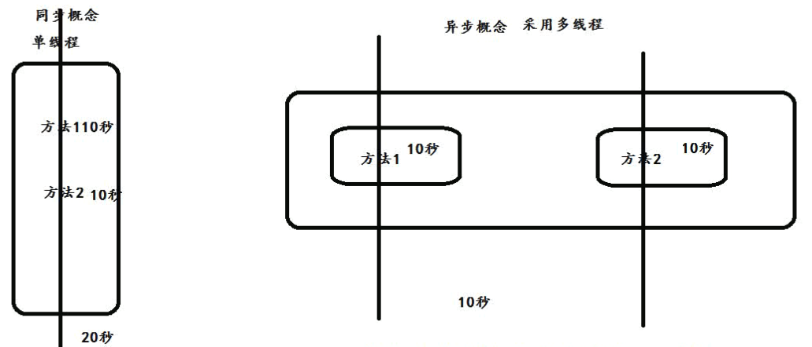
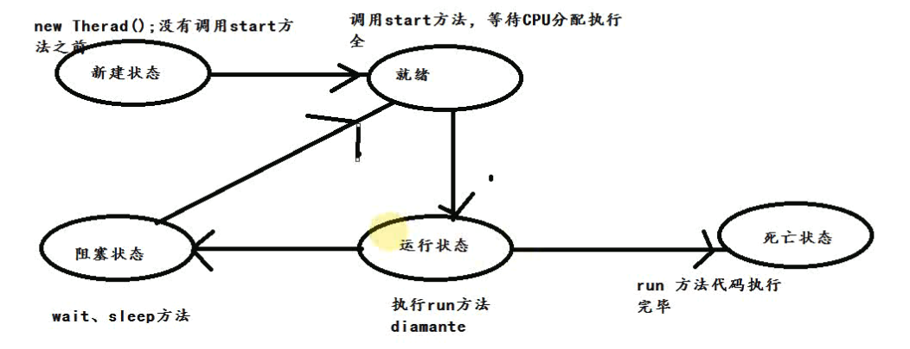
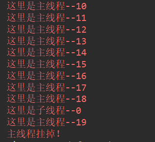
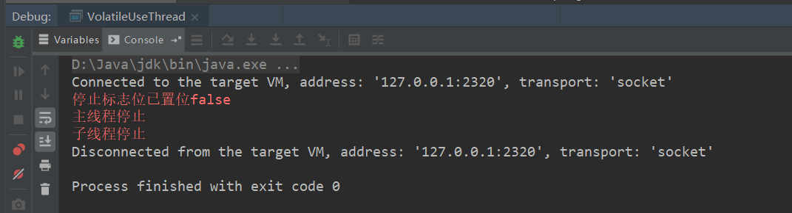

## 1. 目录
1. 线程安全基础知识、synchronized、volatile关键字的使用场景
1. 线程之间通信wait、notify、ThreadLocal、单例、多线程

## 1. 线程安全问题
1. 什么是线程安全：当多个线程访问某一个类（对象或方法）时，这个类始终都能表现出正确行为，那么这个类（对象或方法）就是线程安全的
1. synchronized：可以在任意对象以及方法上加锁，而加锁的这段代码称为“互斥区”或者“临界区”
1. 不添加synchronized的情况
    ``` java
    public class SyncThread implements Runnable {
        public int count=5;
        @Override
        public void run() {
            count--;
            System.err.println(Thread.currentThread().getName()+":count="+count);
        }

        public static void main(String[] args) {
            SyncThread syncThread = new SyncThread();
            for (int i = 0; i < 5; i++) {
                new Thread(syncThread,"thread-"+i).start();
            }
        }
    }
    ```  
    
1. 添加synchronized的情况
    ``` java
    public class SyncThread implements Runnable {
        public int count=5;
        @Override
        public synchronized void run() {
            count--;
            System.err.println(Thread.currentThread().getName()+":count="+count);
        }

        public static void main(String[] args) {
            SyncThread syncThread = new SyncThread();
            for (int i = 0; i < 5; i++) {
                new Thread(syncThread,"thread-"+i).start();
            }
        }
    }
    ```
    
1. 总结：当多个线程访问SyncThread的run方法时，以排队的方式进行处理（顺序由cpu分配，不是代码书写顺序）。一个线程想要执行synchronized修饰的代码，首先是尝试获取锁，如果获得了锁，就执行synchronized修饰的代码，拿不到锁，就会不断地尝试获取锁，直到拿到为止，而且是多个线程同时去竞争这把锁（存在锁竞争问题）

## 1. 对象锁同步与异步
1. 多线程中的同步从概念上讲就是共享，如果不是共享的数据，就没不要进行同步。
1. 多线程中的异步就是独立，相互之间不受到任何制约
1. 同步的目的就是为了线程安全，对于线程安全来说，需要满足两个特性
    1. 原子性
    1. 可见性

## 1. 脏读问题
1. 如何避免脏读问题：完整的一套setValue、getValue都要加锁，保证业务的完整性

## 1. volatile关键字与原子性
1. 背景：  
    先说一下线程执行的时候是怎么处理全局的共享变量的。每个线程都有自己的一个工作内存区，每次线程执行之前，都会去把用到的全局变量存个副本到自己的内存区域
    为了存取一个共享的变量，一个线程通常先会去锁定并清除自己的内存工作取，把这些共享变量从所有线程的共享内存区中正确地装载到自己的工作内存区，然后从线程执行开始直到挂掉，始终操作自己内存区域中的副本，当线程解锁时保证该工作内存区中变量的值回写到共享内存中。在比如说存取款、全局计数器等要求实时更新的场景会引发严重的问题。  
    一个线程可以执行的操作有：使用(use)、赋值(assign)、装载(load)、存储(store)、锁定(lock)、解锁(unlock)
    而主内存可以执行的操作有：读(read)、写(write)、锁定(lock)、解锁(unlock)，每一个操作都是原子的
1. volatile关键字的作用：
    使变量在多个线程之间可见。标记在共享全局变量上，强制子线程在存取变量的时候，到主内存（共享内存）中读取变量，而不是在自己的工作内存区中读取，从而实现了多个线程间的变量可见，也就满足了线程安全的可见性
1. 未使用volatile关键字的情况
    ``` java
    public class VolatileUseThread implements Runnable {

        private Boolean stopFlag = true;
        @Override
        public void run() {
            while(stopFlag){

            }
            System.err.println("子线程停止");
        }

        public static void main(String[] args) throws InterruptedException {
            VolatileUseThread myThread = new VolatileUseThread();
            new Thread(myThread).start();
            Thread.sleep(100);
            myThread.stopFlag=false;
            System.err.println("停止标志位已置位false");
            System.err.println("主线程停止");
        }
    }
    ```  
    
1. 使用了volatile的情况
    ``` java
    public class VolatileUseThread implements Runnable {

        private /*volatile*/ Boolean stopFlag = true;
        @Override
        public void run() {
            while(stopFlag){

            }
            System.err.println("子线程停止");
        }

        public static void main(String[] args) throws InterruptedException {
            VolatileUseThread myThread = new VolatileUseThread();
            new Thread(myThread).start();
            Thread.sleep(100);
            myThread.stopFlag=false;
            System.err.println("停止标志位已置位false");
            System.err.println("主线程停止");
        }
    }
    ```  
    
    
## 1. 线程之间通信


ACID，指数据库事务正确执行的四个基本要素的缩写。包含：原子性（Atomicity）、一致性（Consistency）、隔离性（Isolation）、持久性（Durability）
    1. 一致性：
    1. 原子性：指一个操作是不可中断的，要么全部执行成功要么全部执行失败，有着“同生共死”的感觉