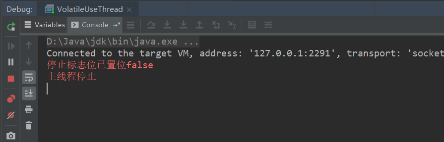

1. 创建线程的方式
    1. 继承Thread类(不推荐，因为Java不支持多继承，推荐实现Runable接口的方式)
        ``` java
        class MyThread extends Thread{
            @Override
            public void run() {
                for (int i = 0; i < 10; i++) {
                    System.err.println("这里是子线程--"+i);
                }
            }
        }

        public class ThreadCreate01 {
            public static void main(String[] args) {
                new MyThread().start();
                for (int i = 10; i < 20; i++) {
                    System.err.println("这里是主线程-"+i);
                }
            }
        }
        ```  
        
    1. 实现Runable接口  
        ``` java 
        class MyRunnableThread implements Runnable{

            @Override
            public void run() {
                for (int i = 0; i < 10; i++) {
                    System.err.println("这里是子线程--"+i);
                }
            }
        }

        public class ThreadCreate02 {
            public static void main(String[] args) {
                new Thread(new MyRunnableThread()).start();
                for (int i = 10; i < 20; i++) {
                    System.err.println("这里是主线程-"+i);
                }
            }
        }
        ```  
        
    1. 使用匿名内部类的方式
        ``` java
        public class ThreadCreate03 {
            public static void main(String[] args) {
                Thread thread = new Thread(new Runnable() {
                    @Override
                    public void run() {
                        for (int i = 0; i < 10; i++) {
                            System.err.println("这里是子线程--"+i);
                        }
                    }
                });
                thread.start();
                for (int i = 10; i < 20; i++) {
                    System.err.println("这里是主线程--"+i);
                }
            }
        }
        ```
    1. 使用线程池创建并管理
1. 同步与异步的概念
    1. 同步：代码从上往下顺序执行  
    1. 异步：另开一条执行路径，进行执行  
    
1. 多线程的状态(5种状态)
    1. 新建状态:就是new了一个Thread实例，还没调用start()方法的时候
    1. 就绪状态:Thread实例调用了start()方法之后，将线程提交到cpu，等待cpu调度
    1. 运行状态:线程运行的情况
    1. 死亡状态:线程运行结束
    1. 阻塞状态:线程运行到一半，由于某种原因停滞等待的情况
    
1. 守护线程与非守护线程
    1. 守护线程就是与主线程共存亡的线程
    1. 用户线程是用户（用代码）创建的（子）线程，不是守护线程，与主线程无关，即主线程挂掉不会影响用户线程
    1. 如何让子线程变为守护线程(```thread.setDaemon(true);```)：
        ``` java
        public class ThreadDaemon01 {
            public static void main(String[] args) {
                Thread thread = new Thread(() -> {
                    for (int i = 0; i < 10; i++) {
                        try {
                            Thread.sleep(300);
                        } catch (InterruptedException e) {
                            e.printStackTrace();
                        }
                        System.err.println("这里是子线程--"+i);
                    }
                });
                thread.setDaemon(true);
                thread.start();
                for (int i = 10; i < 20; i++) {
                    try {
                        Thread.sleep(30);
                    } catch (InterruptedException e) {
                        e.printStackTrace();
                    }
                    System.err.println("这里是主线程--"+i);
                }
                System.err.println("主线程挂掉！");
            }
        }
        ```  
        