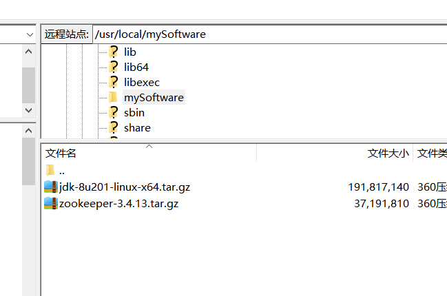

1. 安装包下载：  
    [下载地址1：个人服务器](https://zephrylai-private-write-1256200870.cos.ap-shanghai.myqcloud.com/dev-pack/jdk-8u201-linux-x64.tar.gz)  
    [下载地址2：官网](https://download.oracle.com/otn-pub/java/jdk/8u201-b09/42970487e3af4f5aa5bca3f542482c60/jdk-8u201-linux-x64.tar.gz)  
1. 将下载好的安装包上传至服务器：  
    
1. 新建名为java的文件夹，将安装包移动至目标文件夹并解压
    ``` sh
    mkdir java
    cp jdk-8u201-linux-x64.tar.gz  java/
    tar -zxvf jdk-8u201-linux-x64.tar.gz
    ```
1. 修改配置文件:```vim /etc/profile```，添加如下内容：
    ```
    export JAVA_HOME=/usr/local/mySoftware/java/jdk1.8.0_12
    export  CLASSPATH=$:CLASSPATH:$JAVA_HOME/lib/
    export  PATH=$PATH:$JAVA_HOME/bin
    ```
1. 重新启用配置
    ``` sh
    source /etc/profile
    ```
1. 看一眼版本号（有版本号则间接表示安装成功）
    ``` sh
    java -version
    ```
    