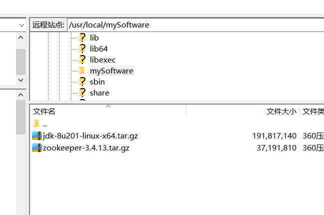

1. 环境依赖：需要java环境([Linux下jdk安装教程](https://github.com/zephyrlai/my-architect-note/blob/master/99.%20%E5%90%84%E7%B1%BB%E5%AE%89%E8%A3%85%E6%95%99%E7%A8%8B/01.%20Linux%E4%B8%8Bjdk%E5%AE%89%E8%A3%85.md))
1. 下载安装包：    
    [下载地址1：个人服务器](https://zephrylai-private-write-1256200870.cos.ap-shanghai.myqcloud.com/dev-pack/zookeeper-3.4.13.tar.gz)  
    [下载地址2：官网](http://mirror.bit.edu.cn/apache/zookeeper/stable/) 
1. 上传至Linux服务器  
    
1. 解压安装包，根据模板配置文件生成实际使用的配置文件
    ``` sh
    tar -zxvf zookeeper-3.4.10.tar.gz
    cp zookeeper-3.4.13/conf/zoo_sample.cfg zookeeper-3.4.13/conf/zoo.cfg
    ```
1. 启动zookeeper(在zookeeper目录下)
    ``` sh
    ./bin/zkServer.sh start
    ```
    
1. 查看zookeeper状态    
    ``` sh
    ./bin/zkServer.sh status
    ```
    